??? toc "Table of Contents"

    - [Welcome, product manager](#welcome-product-manager)
    - [Cambria Labs' approach to modern product development](#cambria-labs-approach-to-modern-product-development)
    - [Balanced team roles](#balanced-team-roles)
    - [Balanced team in practice](#balanced-team-in-practice)
    - [Team rhythm](#team-rhythm)
    - [Your role as a product manager](#your-role-as-a-product-manager)
        - [Understand the product vision](#understand-the-product-vision)
        - [Craft a compelling product vision](#craft-a-compelling-product-vision)
        - [Understand the product strategy](#understand-the-product-strategy)
        - [Plan around outcomes, not features](#plan-around-outcomes-not-features)
        - [Create an outcome-oriented product roadmap](#create-an-outcome-oriented-product-roadmap)
            - [Example: HomeWiFi's outcome-oriented product roadmap](#example-homewifis-outcome-oriented-product-roadmap)
        - [Establish and track against measurable objectives](#establish-and-track-against-measurable-objectives)
        - [Continually de-risk product direction](#continually-de-risk-product-direction)
        - [Create a lean canvas](#create-a-lean-canvas)
        - [The product development cycle](#the-product-development-cycle)
        - [Test your leap-of-faith assumptions](#test-your-leap-of-faith-assumptions)
            - [Example: A lean experiment for HomeWiFi](#example-a-lean-experiment-for-homewifi)
        - [Experiment techniques](#experiment-techniques)
        - [Define your minimum viable product](#define-your-minimum-viable-product)
            - [Examples: Minimum viable products](#examples-minimum-viable-products)
        - [Prioritize features](#prioritize-features)
            - [Example: HomeWiFi feature prioritization](#example-homewifi-feature-prioritization)
        - [Manage the backlog](#manage-the-backlog)
        - [Balance value, quality, and constraints](#balance-value-quality-and-constraints)
        - [Managing backlogs with Pivotal Tracker](#managing-backlogs-with-pivotal-tracker)
            - [Story workflow](#story-workflow)
            - [Plan with stories](#plan-with-stories)
            - [Write user stories](#write-user-stories)
                - [Example user stories: good vs. bad](#example-user-stories-good-vs-bad)
            - [Other story types in Tracker](#other-story-types-in-tracker)
        - [Run the iteration planning meeting](#run-the-iteration-planning-meeting)
        - [Decide when to ship software](#decide-when-to-ship-software)
        - [Help establish a sustainable pace](#help-establish-a-sustainable-pace)
        - [Communicate effectively](#communicate-effectively)
    - [Glossary](#glossary)
    - [Reading List](#reading-list)
    - [Credits & Contributions](#credits--contributions)

## Welcome, product manager

Working as a product manager in a software development team is a multifaceted and challenging role. Cambria Labs is here to help you and your team build products that deliver meaningful value for your users and your business.

Whether you're a seasoned veteran, a first-time product manager, working in an enterprise, or working in a start-up, this playbook will help you get a sense of the roles, tools, patterns, and methods that lay the foundation for a healthy, sustainable, lean, and agile product development practice. Cambria Labs has years of experience enabling clients in these practices.

When partnering with Cambria Labs, our clients are committing to work with collaborators rather than contractors. Together, we build software based on continuous input. Clients maintain full control of product direction, feature prioritization, and release timing. Cambria Labs practitioners do the following:

- Show clients how to continuously keep product and business risk low by identifying risky assumptions, while gathering and analyzing qualitative and quantitative data to help inform product decisions.
- Help clients balance business goals against both user's needs and desires, as well as technical feasibility so that the team regularly ships features that have an impact.
- Show clients how to set goals and structure regular meetings to ensure fluid communication among developers, designers, stakeholders, and sponsors.
- Help clients break down big ideas into manageable pieces, establish a reliable way to estimate features, and ensure a predictable cadence of small and frequent releases.
- Encourage the entire project team to provide regular feedback and self-reflection on process and performance, which will drive continuous improvements
in efficiency and increase happiness.

### What clients should expect during a project with Cambria Labs

**Learn by doing**

We teach by showing, rather than by telling. In the beginning, we'll lead but will coach you so that you can take over in short order.

**Sit with your team (or, remotely sit with your team)**

Co-location or having shared virtual space is crucial to faster feedback loops. By being together with your team physically or remotely, you'll be able to continuously answer questions your team encounters along the way.

**Collaborate constantly**

We believe that the best products are informed by diverse perspectives. You'll be partnering with developers, designers, and business stakeholders to inform your product decisions.

**Own the product**

It's your responsibility to validate product features and design, collect, and prioritize input to inform product decisions, write stories, maintain the backlog, and help run meetings.

**Go at a sustainable pace**

Healthy product development is a marathon, not a sprint. By maintaining a 40-hour workweek, we keep a sustainable and predictable pace that helps us continually ship value quickly.

**Lean on us for help**

You'll work closely with your Cambria Labs product manager. When in doubt, lean on us!

## Cambria Labs' approach to modern product development

Our approach to product development is informed by more than 30 years of experience and continuous improvement. We blend values, principles, and practices from three schools of thought:

- Lean startup
- User-centered design (UCD)
- Agile/extreme programming (XP)

Additionally, we apply these philosophies within the structure of a "balanced team."

Cambria Labs didn't invent these philosophies; we have many individuals and teams to thank for sharing and refining these ideas. We have, however, developed our approach, tools, and platforms to enable these practices. Taking aspects of each philosophy, we combine and apply them using discipline, empathy, humility, curiosity, and a strong bias to action. We'll work closely with you to figure out how to adapt these methodologies for your organization. Our approach is always evolving as we continue to uncover new and better ways of building great software. What follows is a quick primer on product development, which will help you understand how we work.

**Lean startup**

A lean startup is an approach to developing businesses and products in environments with high uncertainty and change. It was created by entrepreneurs Eric Ries and Steve Blank. The two based their ideas on lean manufacturing, which was popularized by Toyota as a means of minimizing waste and maximizing productivity.

Most products fail because they're based on flawed assumptions about user needs. Lean startup emphasizes investigating and validating assumptions around what customers need and meeting those needs with as little time, effort, and money as possible. Customer feedback is vital during product development. It ensures that we don't build products that customers don't want. The lean startup approach also borrows from the scientific method; it assumes we don't know something to be true unless we gather evidence to validate our beliefs. (Source: Eric Ries, The Lean Startup, Crown Publishing, 2011.)

**Common practices**

Minimum viable product (MVP), assumptions, continuous deployment, actionable metrics, pivot or persevere, build-measure-learn cycles, lean canvas, CI/CD

**User-centered design**

User-centered design (UCD) is a product design philosophy that emphasizes designing the product around how the user can, wants, or needs to use it, rather than seeking to change the user's behaviors to fit the product.

We consider a user's needs from the very beginning of the product cycle and continuously validate our assumptions about their behaviors and problems. Using investigative methods like ethnographic study, contextual inquiry, and prototype testing, we validate and refine our understanding. The whole user experience is considered; we seek to understand the user's full context rather than just the task(s) they would complete by using the product.

We conduct the design work iteratively, testing and evaluating design options early and often. Users are directly involved in the design process. Through observation and interviews, we seek to gain empathy for our users' goals, and use what we learn to ideate and evaluate design options and to inform design and development decisions.

Perhaps the most influential writing done on UCD is Don Norman's *The Design of Everyday Things* (Basic Books, 2013) and Jeff Gothelf's *Lean UX* (O'Reilly Media, 2016).

**Common practices**

User interviews, personas, scenarios, think-make-check cycles, rapid prototyping, assumptions, validation, MVP

**Agile/XP**

Agile is a set of values and principles that enable teams to develop software with agility. Agile teams are quick, flexible, and responsive to change, without sacrificing quality. Although there are many implementations of this methodology, most use collaborative, cross-functional, and self-organizing teams to deliver software incrementally and iteratively.

Extreme programming (XP) is a specific set of practices that implement agile values and principles. It was created by Kent Beck, author of Extreme Programming Explained: *Embrace Change* (Addison Wesley, 1999).

XP enables teams to write high-quality software, ship it often and predictably, and be responsive to change. It's a strategy to help teams go fast, forever. XP is also a system - we only get to experience its full benefits when we implement all of its practices. That's why it's called extreme programming!

**Common practices**

Pair programming, test-driven development (TDD), refactoring, collective code ownership, delaying decisions until the last responsible moment, expecting changes in requirements, frequent communication, small and frequent releases

!!! note

    If there's a term here that is new to you, there's a good chance you'll find a definition for it in the [glossary](#glossary) at the end of this guide.

**Balanced team**

Our product teams are small, co-located or remote, and multidisciplinary. They are organized around goals established by the product sponsor(s) and are empowered to define and iterate on solutions that deliver against those goals. They're also empowered to talk to customers, make product decisions, and push code to production. By sitting next to each other or sharing virtual space, team members constantly communicate and collaborate. Teams are focused on delivering customer value through working software in small, iterative releases, and are self-organizing in that they can adapt common tools and practices to what works best for all members. Communication among team members tends to be informal, favoring spontaneous conversation over lengthy meetings.

The concept behind this approach is what's known as a "balanced team." It was created by a group of passionate agile practitioners who sought to better blend agile, UX, and other product disciplines. Early proponents of the balanced team concept include Jeff Patton, David Hussman, Desiree Sy, Jared Spool, and Lane Halley. Former Pivotal employees Janice Fraser and Tim McCoy were early participants, and Pivotal Labs hosted one of the first balanced team retreats.

Though each project varies, the typical balanced team mix includes a Cambria Labs product manager, product designer, and engineer matched with full-time client counterparts. When we work within the construct of a balanced team, we ensure that all of these perspectives blend into and inform each other so that we build products that are desirable, usable, feasible, and viable.

**Common practices**

Shared vision, physical co-location, pairing across functions, scaling the team up/down based on what the product needs

## Balanced team roles

Team makeup and size can vary between product teams. What's important is having the right balance of skills and perspectives to make informed product decisions.

**Your role as product manager**

The product manager leads a team to discover and deliver a product that creates meaningful value for the company and its users. You'll facilitate decision-making in service of shipping successful features. To do so, you'll need to clearly understand who your users are and what they need, what impact the business expects from the product, and who your stakeholders are. You'll also need to collaborate closely with your team.

**Cambria Labs product manager pair**

In Cambria Labs projects, we pair client product managers with a Cambria Labs product manager who will guide and support the client product manager throughout the project. This pairing partner helps client product managers understand their role on a balanced team and learn how to take a lean/agile approach to product management. By applying the "I do, we do, you do" approach throughout the project, client product managers will gradually take the lead, with the Cambria Labs partner transitioning to a supporting role.

**Other roles on your team**

These are the most common roles you'll see on a balanced team. However, your team's roles may differ slightly depending on your product.

**Engineers**

Engineers implement stories from the backlog. They also assist with story estimation in the iteration planning meeting. Engineers guide the implementation and help you understand the technical implications of product decisions. You'll help them gain an understanding of what product success looks like, and work together to validate your backlog's prioritization.

**Anchor**

One engineer is designated as the anchor. The anchor ensures that the team makes sound technical decisions, that engineering practices are healthy and appropriate, that new and junior engineers get up to speed quickly, and that the engineering team collaborates well with product management and design. The anchor also ensures that the team collectively owns the codebase and understands the engineering decisions that are made. You'll collaborate more closely with your anchor than with the other engineers on your team.

**Designer**

Designers deliver value in the form of design decisions. Their job is to deeply understand the users to define solutions that are desirable, useful, and usable. You'll work closely with your designers, pairing on user research to validate critical user and solution assumptions before adding development work to the backlog.

**Delivery lead**

Each team has a Cambria Labs delivery lead. The delivery lead is responsible for the client relationship and the overall success of the project from the perspective of both the client and Cambria Labs. If needed, the delivery lead also helps to unblock the team and provide day-to-day support.

**Stakeholder and collaborators**

We often work closely with marketing, compliance, risk, infrastructure teams, legal, and other stakeholders. A good general rule for groups like this is to assign a point person, establish a regular touchpoint, and provide visibility into each other's roadmaps and/or backlogs with some ability to influence them. If it makes sense, we make members of these groups co-locate with us on our balanced team.

## Balanced team in practice

To build a successful product, we need to answer three questions:

1. Will it solve users' problems?
2. Will it help our business?
3. Can we build it well?

Lean startup, user-centered design, and agile/XP help us identify the best answers to these questions. When we work within the construct of a balanced team, we ensure that all of these perspectives blend and inform each other.

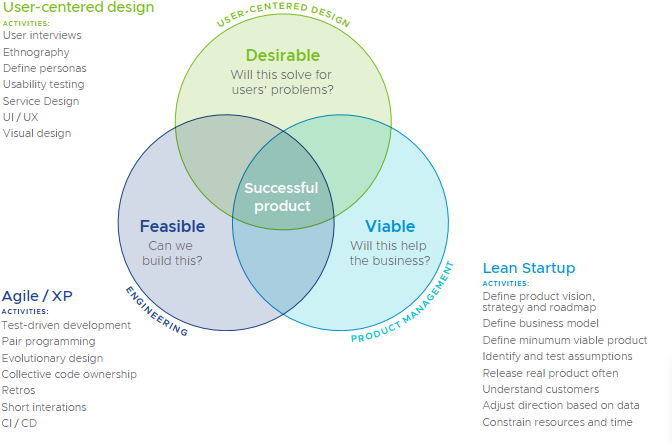{: class="width-90"}

**Desirability: Will it solve users' problems?**

The product should be something that users want and that solves real problems. A designer's primary question is, "How is the user affected?" More than anyone else on the team, designers help us answer these fundamental questions: "Is this a problem worth solving for users?" and, "Does this design solve the problem?"

!!! caution

    If designers become too focused on user needs and cannot connect with business needs and technical feasibility, they'll focus on solution ideas that can't be implemented or won't deliver a return on investment.

**Viability: Will it help our business?**

The product has to support a sustainable business model. The product manager's primary question is, "By solving these specific user problems with these specific solutions, are we creating valuable user and business outcomes?"

!!! caution

    If product managers become too focused on the business and cannot connect with users, they'll likely focus on solutions that don't solve any real needs, and thus don't get used.

**Feasibility: Can we build it well?**

Product implementation has to be feasible and robust. Engineers' primary question is, "What technical implementation will best satisfy the project and product goals?" Engineers help us debate the feasibility and merit of potential solutions while remaining mindful of technology constraints.

!!! caution

    It doesn't help engineers to come up with feasible solutions that don't solve problems for users; that's not developing good software. And if we home in on a solution that's desirable and viable yet not feasible, we've failed.

## Team rhythm

A healthy lean and agile team has a strong and consistent rhythm. Each week is punctuated by a small set of standing meetings.

| **DAILY MEETINGS**  | **PURPOSE**                | **YOUR ROLE**                                           |
|:--------------------|:---------------------------|:--------------------------------------------------------|
| **Office standup**  | Kick off the day with "new faces", "helps", "interestings", and "events". | - Announce new teammates or guests.   - Ask for help if you need it.   - Share things you've learned that could help other teams. |
| **Project Standup** | Check in on everyone's progress, plan, and blockers | - Understand blockers and their implications on the current priorities.   - Remind everyone of action items and upcoming milestones.   Make sure team members take turns facilitating standup. |

| **WEEKLY MEETINGS**     | **PURPOSE**               | **YOUR ROLE**                                           |
|:------------------------|:--------------------------|:--------------------------------------------------------|
| **Optional: Pre-IPM**   | Ensure the week's backlog includes stories that are ready to be estimated and discussed in the IPM | - Ensure stories are well  written.   - Confirm the splitting of stories with input from the developers. |
| **Iteration planning meeting (IPM)** | Estimate the complexity of the iteration's backlog of prioritized user stories that the engineers can pick up for implementation (product manager leads) | - Communicate the user value and business value of each story   - Clarify any confusion and update stories.   - Confirm the priority of stories with input from the developers. |
| **Sponsor and stakeholder update** | Share the team's progress in terms of validated learning and working software, demo the working product, raise blockers, give an update against KPIs, and share what the team plans next. | - Prepare the agenda with your anchor and designer.   - Use your product roadmap to explain what the team is working on and why.   - Frame your demo in the context of the outcomes defined in your product roadmap.   - Speak to the empirical data guiding the team's decisions.   - Speak to your assumptions, both those you have tested and those you plan to test soon.   - If blocked, explain what the team needs, why, and by when.|
| **Retro (short for "Retrospective")** | Create a safe space for the team to celebrate the past week's successes, discuss points of confusion, and reflect on challenges | - Openly and honestly share your experiences from the week.   - Dig deeper on items raised by others to understand root causes |

## Your role as a product manager

Product managers, in close collaboration with their teams, help their company ship the right product. Increase your effectiveness in this role by familiarizing yourself with the set of tools, techniques, and practices described in this playbook. They'll help you build products by defining and iterating toward the right outcomes, while continuously validating and iterating toward the right solution in a way that will enable you to be responsive to changing user demands and market realities.

|                                                         |                                                    |
|:--------------------------------------------------------|:---------------------------------------------------|
| 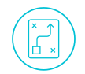{: class="lightbox-skip-img"} | [**Articulate the product vision and product strategy**](#understand-the-product-vision)   So that we know why we're undertaking the effort of building the product, and what our plan for doing so is. |
| {: class="lightbox-skip-img"}    | [**Establish an outcome-oriented product roadmap**](#create-an-outcome-oriented-product-roadmap)   So that we have clear outcomes to prioritize our work against, and can communicate to sponsors and stakeholders how the product is likely to evolve over time. |
| {: class="lightbox-skip-img"}               | [**Establish and track against measurable objectives**](#establish-and-track-against-measurable-objectives)   So that we know whether or not we're on the right path. |
| 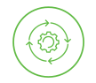{: class="lightbox-skip-img"} | [**Continually de-risk product direction**](#continually-de-risk-product-direction)   So that we only build the features we should build, based on validated customer problems and business opportunities, and increase the likelihood that the product will be successful in the market. |
| {: class="lightbox-skip-img"}                 | [**Prioritize features**](#prioritize-features)   So that we're always working on the most valuable thing. |
| {: class="lightbox-skip-img"}                  | [**Manage the backlog**](#manage-the-backlog)   So that the product team has a shared focus across tactical design and development work. |
| {: class="lightbox-skip-img"} | [**Decide when to ship software**](#decide-when-to-ship-software)   So that we know why we're undertaking the effort of building the product, and what our plan for doing so is. |
| {: class="lightbox-skip-img"} |  [**Help the team maintain a sustainable pace**](#help-establish-a-sustainable-pace)   So that we can go fast forever and not burn out or lose motivation. |
| {: class="lightbox-skip-img"}            | [**Communicate effectively**](#communicate-effectively)   So that the product team, stakeholders, and sponsors are all aligned and we maintain momentum. |

### Understand the product vision

The product vision describes the future we're trying to create through our product, and how our product intends to contribute to our company's larger purpose.

**Vision**

The product vision describes the **WHAT** and the **WHY**. It's highly aspirational and long-term, and as such, realizing it may take several years (approximately five or more).

**The product vision is your true north**

The product vision states what the product could ultimately become in support of your company's overarching purpose. It reflects the core values, motivations, and intentions of a team or company. It's often referred to as a team's "true north," in that it defines the product's direction and guides the team's every decision and action.

Your product vision should communicate:

- Who you're creating the product for
- What needs or desires the product will address
- What benefits the product will create

**Why you need a product vision**

Ideation and experimentation alone will not enable us to create great products. Without a vision, we're left to aimlessly iterate toward some unknown destination. If we don't know where we want to go, how will we know if we're getting there?

Your product vision helps tell the story of your product. It explains
what you hope to achieve and sets the direction for where you're going. A compelling product vision should accomplish the following:

- Help others understand your product and why it matters.
- Align, guide, and motivate everyone involved to make the product successful.
- Create focus and enable effective collaboration amid rapidly changing conditions.

**Who defines the product vision?**

Depending on how your organization is structured, your product vision might be defined by senior product or business leaders like CPOs or CEOs. At a start-up, it might be the founder. At an enterprise, it might be a product owner, director, or VP. If this is the case, you need to make sure you clearly understand their vision. Write down what you understand it to be and validate it with them.

**Clearly display your product vision**

Post your product vision somewhere in your workspace where it's visible to everyone! That way, it'll be a constant reminder of what you're working towards.

**Examples:**

:   - **Amazon:** Our vision is to be earth's most customer-centric company; to build a place where people can come to find and discover anything they might want to buy online.
    - **LinkedIn:** To connect the world's professionals to make them more productive and successful.
    - **Spotify:** To enable people to have music moments everywhere.

### Craft a compelling product vision

Getting to the right vision statement for your product can be challenging and take some time.

**Best practices for creating a good product vision**

**Keep it short**

:   Your product vision must be easy to understand, remember, and communicate. Try to keep it to one or two sentences.

**Align it with your company vision**

:   Your vision should communicate how your product will contribute to your company's larger purpose. If your company has one product, then your company vision also makes for a great product vision. If your company has a portfolio of many products, then you should align your product vision with your particular business unit or group's reason for being.

**Focus on the user**

:   The product vision should answer who the product is intended for, what needs or desires the product satisfies for its users, and what benefit(s) those users can expect to experience by using the product.

**Avoid specific solutions**

:   Your vision should describe the positive impact your product is intended to have. It shouldn't explain what your product is or how it works-you'll figure those things out through your product strategy and product roadmap. If your vision makes any statements about particular features or technology choices, it will limit you later on, preventing you from being flexible to new information and changing circumstances.

**Make it big and ambitious**

:   A bold product vision will help you remain flexible in terms of the product strategy you pursue and how. It will enable you to expand and develop both your product and your business over time as the market changes, particularly what customers need and want.

**Be inspirational**

:   The product vision should be something that people care about and can connect with. If it clearly states the benefits you're looking to create for others, you're already halfway there. A vision that matters will motivate the team when things get tough, make people excited to work on the product, help attract new team members, and connect your product with the right customers.

**Be unique**

:   Explain what sets your product apart from other alternatives, and why it matters. This will help you connect with the right customers and attract new team members who want to contribute to making the product vision real.

**Iterate**

:   Make sure that even existing products, not just new ones, have a clear vision statement. If your vision stops being aspirational or motivational, or if it doesn't ring true for customers, articulate a new and better vision statement.

**Get validation**

:   It may feel challenging to come up with a good product vision. The more time you spend talking to your customers and users, as well as the people running your group or company, the clearer your vision will become. Use their feedback to understand whether your vision resonates, and iterate until you get to something that feels right.

!!! action

    Work together with your team to capture your product vision statement. Make sure it's shared with your team and accessible so they can see and refer to it regularly.

### Understand the product strategy

Your product strategy is a high-level plan for realizing your product vision. It defines your path forward by addressing the challenges you must overcome and the initiatives you believe will help you do so.

**Strategy**

The product strategy explains **HOW** we'll realize our product vision. It might span several years.

**Strategy is the practice of figuring out how to get from here to there**

Product strategy is about figuring out what product to make such that we achieve one or more goals under conditions of high uncertainty. Consequently, strategy is also about knowing what not to build, what to say no to, and why.

Whether you're part of a large enterprise or a start-up, your product strategy should always be in the service of your product vision, which provides the context for why you're building the product in the first place. The vision is what inspires us and the strategy is what gets us to the vision.

The product strategy covers a set of answers to questions about the path forward:

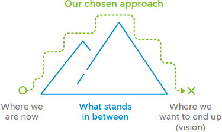{: class="float-right width-30"}

- Who are your key customers and users?
- Which problems do you intend to solve for your key customers and users to realize your business objectives?
- How is your solution different from others?
- Which market(s) will you focus on (vertical and geographical)?
- How will you price and market your product?
- How will you measure success?

**Strategy is about making choices around where we should invest**

As product managers, we're inundated with requests and ideas. How do we know what to say no to? We can't do everything, because the time, money, and resources we have available to invest in our product are finite. Additionally, a product that does everything for everyone will do nothing well for anyone-and by the time we launch it, our competition may have raised the stakes beyond our grasp.

We need some way of knowing that we're working on the right things and are making good progress toward our vision. A product strategy helps us identify the right objectives and decide where to invest to best achieve those objectives.

**Who defines the product strategy?**

It might be you, or it might be your management team-your group/business unit director or your VP of product.

> "The product strategy is our sequence of products we plan to deliver on the path to realizing the vision."
>
> MARTY CAGAN

!!! action

    Work to articulate and define your product strategy to realize your product vision. Make sure the product strategy is shared with your team and accessible so they can see and refer to it regularly.

### Plan around outcomes, not features

Your roadmap communicates how you intend to realize your strategy. It aligns the product work with overarching business goals and helps communicate the current and future state of your product.

**Roadmaps facilitate alignment and cross-team coordination**

Your roadmap might be your most important communication tool as a product manager. It creates visibility into your work for people outside of your immediate product team. It helps product sponsors, and stakeholders like sales, marketing, customer support, and other product teams understand your product vision, your goals, and the steps you intend to take to achieve those goals.

You can and should use your roadmap to help stakeholders, collaborators, and product sponsors understand what's coming up next and coordinate joint efforts and dependencies with other teams. By clearly communicating your goals and priorities, you'll help surface important conversations early and keep the product work aligned with the needs and priorities of the business.

**Be stubborn on vision and flexible on details**

If you've seen a product roadmap before, chances are you've seen a
comprehensive plan spanning several years, with detailed feature specs, timelines, work estimates, and ROI predictions.

Lean and agile product teams approach product planning differently. No plan survives its first encounter with reality. We learn more from building and releasing features than from planning. Additionally, we reduce risk in our deployments by deploying incrementally, with smaller net changes. Remember, we work in build-measure-learn cycles! Therefore, we should spread our planning throughout the project instead of front-loading our work with detailed plans.

What matters is that we get to the right place in the end, not that we follow the exact path we envisioned when we set out on our journey. Rather than trying to optimize for predictability in an inherently unpredictable world, we optimize for learning and responding to change as quickly and cheaply as possible. With the product vision as our true north, we articulate a high-level direction for getting to that vision (our product strategy) and define a plan for our immediate next steps (our product roadmap). As we move forward and learn more than what we knew when we started, we refine and adjust our roadmap accordingly.

**Outcomes matter more than features**

The roadmap should emphasize the results we want to realize-like improved product and business metrics rather than the features we believe should be part of our product. This approach creates agreement on what success looks like while enabling us to be flexible in our solution. Being outcome-oriented enables us to iterate toward the best solution as we learn more about the market, our customers and users, and what's technically feasible.

In addition to focusing on the impact we want to have through our product, an outcome-based approach to planning helps us do the following:

- Create a shared understanding of why we're building the product.
- Create alignment among stakeholders, sponsors, and the product team.
- Prioritize feature ideas and requests better, because our team mandate is clearer.
- Feel more engaged in our work by being empowered to solve a problem.
- Figure out which parts of our strategy are working and which are not.

### Create an outcome-oriented product roadmap

Your product roadmap describes how your product is likely to evolve.

**Work backwards from your vision and strategy**

Your roadmap should consist of sequential goal - your strategy - that helps build toward your vision. To define your goals, identify the key challenges you need to overcome first. Also, look at any known strategic outcomes that have been defined by the business. Outcomes are the important and measurable impacts we want to create for our customers and our business, like increased market share, more paying customers, or less tech debt.

You should have clarity on the following:

- The problems that need to be solved
- How do you intend to solve them
- How you'll know you've solved them

**Identify the work that needs to get done first**

Once you know your business goals, capture your assumptions about how you might reach those goals. You probably want to identify and validate your assumptions about what customer problems you need to solve, the features that solve those problems, how you might design and implement those features, the business value the solution would deliver, and possibly also how you'd market and operationalize the product.

When you prioritize assumptions to validate product work to execute, ask yourself the following:

- What dependencies do you need to solve first?
- What do you need to learn first? This will help you create a list of learning objectives, features, and activities you believe will help make an impact against your business's strategic objectives.

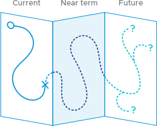{: class="float-right width-30"}

**Plan across three horizons**

To communicate the rough order of your priorities, organize your roadmap into three-time horizons:

- Current: This is work you're doing now.
- Near term: This is work coming up soon.
- Future: This is work you're thinking of doing but need to research more.

It's most important to have clarity on your first few goals. Your roadmap will evolve and change over time, and the further out a goal is, the more it's likely to change before you get to it.

**Roadmap design principles**

1. Communicate the direction you plan to go in to realize your vision.
2. Assume uncertainty and change; optimize for learning and responding.
3. Frame the workaround desired outcomes, not outputs.
4. Make sure your roadmap is easy to update and share.

!!! action

    Create an outcome-oriented product roadmap and make sure you include input from design and engineering. The roadmap should also be shared with the team so they can refer to it as they would the vision and strategy.

#### Example: HomeWiFi's outcome-oriented product roadmap

Meet HomeWiFi, a provider of home Wi-Fi systems.

**Company vision:**

:   HomeWiFi's vision is to provide a superior in-home Wi-Fi service that just works.

**Current state:**

:   HomeWiFi targets affluent homeowners who own one or several large properties. Through customer research, HomeWiFi has learned that these homeowners want home connectivity with a high level of convenience, reliability, and speed as they use their networks primarily for home security and secondarily for communication and entertainment.

    HomeWiFi gets a sizable share of its new customers through the third-party installer market. These installers help customers get their Wi-Fi network up and running. They also monitor the network post-installation on behalf of the customer to ensure that everything is running smoothly. Homeowners often have a long-standing relationship with their installers. They expect a responsive, high-touch customer service experience provided directly by their installer, either in person or remotely.

**Opportunity:**

:   HomeWiFi doesn't currently offer third-party installers any tools for working with its systems, which makes its systems more challenging to install and support, and compromises upper-end installers' promises to their affluent homeowner customer segment to provide superior customer service.

    To be more competitive in the upper-end installer market, HomeWiFi has decided to develop an application to help installers troubleshoot networking issues.

**Product vision:**

:   Become the tool that enables HomeWiFi installers to be the smartest and most efficient installers in the industry.

**Product strategy:**

:   Create a dashboard that enables installers to detect, troubleshoot, and resolve networking issues remotely before the customer notices.

**Example: HomeWiFi's outcome-oriented product roadmap**

|                   | **CURRENT**               | **NEAR TERM**            | **FUTURE**                     |
|:------------------|:--------------------------|:-------------------------|:-------------------------------|
| **Desired outcomes** | Installers can solve customer issues without making customer visits | Installers do not need to call HomeWiFi tech support |  Installers can resolve customer issues in under 60 minutes |
| **Key challenges** | - Installers cannot reboot customer networks remotely   - Installers forget to complete their registration process | - Installers don't have a way to push firmware upgrades to nodes   - Installers forget to complete their registration process  | Installers don't have visibility into historical information about the network |
| **Success metrics** | 80% of issues are resolved remotely | 80% decrease in tech support calls from installers | 90% of issues are solved in 60 minutes or less |  
| **Features**      | (To be defined, designed and validated) | (To be defined, designed and validated) | (To be defined, designed and validated) |

### Establish and track against measurable objectives

To know whether we're on the right track to deliver on our product goals, we need to establish clear objectives and metrics.

**Goals change throughout the product lifecycle**

Goals have a long time frame, articulate a high-level outcome we strive toward, and may not be directly tangible or measurable. They're our desired outcomes and are often strategic, such as "increase sales" or "keep customers happy." Your goals will likely depend on what stage you're at in your project and with your product, which in turn will determine what question(s) you're looking to answer. Early on in the product lifecycle, we seek to validate a product. Later on, when we have a validated product, we look to optimize our business model as much as possible.

**Objectives make goals more achievable**

Objectives are the specific, measurable, achievable, and tangible actions we take to realize our goals. One goal can be broken down into several objectives, which helps us break down a big challenge into many smaller challenges. A good practice is to make sure that your objectives are SMART: specific, measurable, attainable, realistic, and time-bound.

**Clear goals and objectives help minimize waste and maximize value**

We must have complete clarity on why we invest time in various activities, such as talking to customers, exploring technology X, or building feature Y. Everything we spend time, money, and effort on tries to help us realize an important objective.

**Metrics enable us to track progress**

Metrics are numbers that define standard measurements that are important to us. Metrics that help us assess how well we're doing against key business objectives are called key performance indicators (KPIs). It's important to take note of your baseline metrics before making any changes so that you can compare the before and after or run split tests.

**Beware of vanity metrics**

Good metrics are actionable, which means they do one or more of the following:

- They tie back to specific and repeatable tasks that you can improve upon, and to your product and business goals.
- They're expressed as a ratio of two things, like the percentage of users who make a purchase.
- They have a time component, which enables you to see change over time so that you know whether you need to take action.

Vanity metrics are numbers that tell us about the current state and often make us feel great because they are big, but offer no insight into how we got to where we are or what to do next. Examples include the total number of visitors and the total number of downloads.

**Tying it all together**

**Example: Online retailer**

- **Goal**: Improve customers' satisfaction with our site experience
- **Objective**: Improve site performance
- **KPI**: Increase site availability measured over the last month from 97.5 percent to 99.5 percent

**Example: Online media property**

- **Goal**: Improve profitability
- **Objective**: Increase banner ad revenue
- **KPI 1**: Visitor loyalty (average number of returning visits per month)
- **KPI 2**: Clickthroughs (average number of banner ad clicks, per user, per month)

**Example: On-demand car service**

- **Goal**: Create a mobile app customers love
- **Objective**: Become a top-rated app (i.e., greater than 4.5 stars) in the iOS App Store
- **KPI**: Average iOS App Store rating

!!! action

    Define and add Goals, SMART objectives, and KPIs at each time horizon of your outcome-oriented roadmap. This will help the team focus their efforts appropriately.

### Continually de-risk product direction

We'll have many ideas for our product. How do we know which ones are good and which are bad?

**Untested assumptions create risk**

Before executing product ideas, teams should clarify their thought process and test their ideas so that they move forward with confidence. An untested assumption is something that a team believes to be true without corroborating evidence. Moving ahead without validation is risky for the team because it could lead to wasted effort. We need to answer some important questions before we're ready to build a product.

**Uncover risks with these questions**

**Product risks**

- Do we have a meaningful problem to solve?
- Can we validate a minimum viable solution that people find useful?
- Can we scale that solution?

**Customer risks**

- Are there enough people who experience this pain point?
- Can we effectively reach these people?
- Can we effectively reach these people at scale?

**Business risks**

- Will a sufficient number of people pay enough for the product?
- Can we define cost and revenue structures that enable us to have a sustainable business?

**Technology risks**

- Can we implement the solution well?
- Can we maintain and continue evolving the product over time?

**Team risks**

- Can we take action and move forward effectively? Do we have access to users? Do we have access to the business context we need? Can we ship to production? Can we maintain a sustainable pace as a team?
- Do we have a clear shared focus, so that we can move quickly and do the right thing?
- Do we have the right skills and perspectives available and access to all the inputs we need to make good decisions?

Our initial attempts to answer these questions are assumptions until proven valid through empirical data. It's when we make product decisions based on assumptions rather than on careful analysis of data that we accumulate risk.

**How do we de-risk our product?**

Generally speaking, we want to do the following:

- **Validate a meaningful problem**. This is a need or desire that's strongly felt by a sufficient number of people.
- **Validate a solution that is feasible, desirable, and viable**. This is a way to address the need or desire such that people are satisfied, and will pay for it.
- **Validate a viable business model**. This is a plan for building, providing, and maintaining the product in a way that makes money.

To achieve these goals, we have to continuously prioritize our riskiest assumptions, design and run experiments, analyze the experiment data, and determine whether our assumptions were validated or invalidated.

!!! action

    Articulate and prioritize the riskiest assumptions that could derail your efforts, adding them in alignment with your roadmap time horizons. Track whether these assumptions are tested and validated (or invalidated) and use these learnings to adjust your plans whenever necessary.

### Create a lean canvas

The lean canvas helps us stay disciplined when it comes to documenting and validating our riskiest business model hypotheses. (Source: <https://leanstack.com/lean-canvas>)

**The product is only one component of a successful business**

It's important to remember that your product alone doesn't make for a successful business. You also need to ensure the product is driving business impact. The lean canvas helps us capture and systematically mitigate the riskiest aspects of creating a business. Think of it as a topographical map for developing and validating a business plan. It's an important tool to help us stay aligned around what a successful business looks like.

The lean canvas was developed to help entrepreneurs define new products. It can also be used to clarify how an existing product drives business impact, and where there may be opportunities for optimization.

**Components of a lean canvas**

A lean canvas consists of several key components:

- **Problem:** Our customers' top three underserved or unaddressed needs
- **Solution:** The top three features we believe will address our customers' problem
- **Key metrics:** The key activities we measure
- **Unique value proposition:** A clear and concise message that states how we're unique and worth engaging with
- **Unfair advantage:** Something we have that can't be easily bought or copied
- **Channels**: Our path to our customers
- **Customer segments:** Our target customers
- **Cost structure and revenue streams:** How we plan to spend and make money

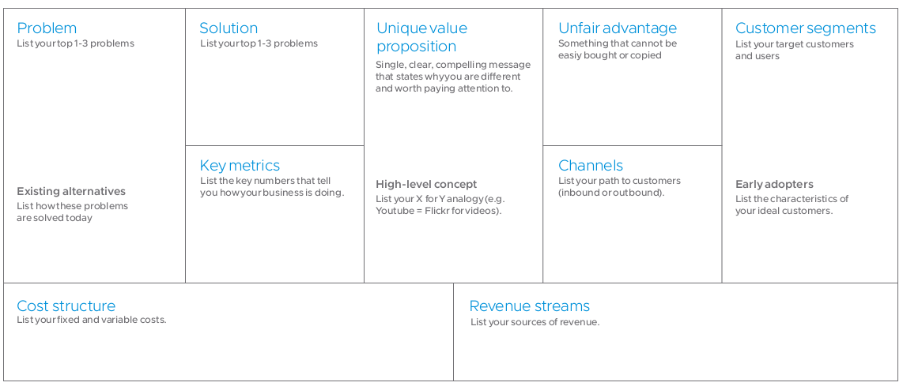

### The product development cycle

We use a "build-measure-learn" feedback cycle to continuously turn uncertainties and assumptions into facts. Starting with ideas, we identify our riskiest assumptions, build simple tests, run those tests, analyze the test data, and then use what we learn to inform our next steps. In other words, we don't treat product definition, design, development, and testing as separate phases. Instead, we do all of these activities in parallel via short and frequent cycles throughout the product lifecycle.

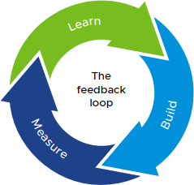{: class="float-left width-30"}

**Learn from data analysis whether to pivot or persevere**   ACTIVITIES:

Validate or invalidate the riskiest assumptions about personas, choose the top problems to solve review existing solutions, test the desirability of a solution, determine the feasibility of a solution, assess the viability of the product, review the sustainability of the business model, optimize that business model

**Build small and simple tests to collect metrics**   ACTIVITIES:

Interview scripts, value propositions, prototypes, minimum viable products, usability tests

**Measure test results**   ACTIVITIES:

Customer observations and interviews, split tests, real-time monitoring, funnel analysis, cohort analysis, search engine marketing

**Why?**

We work within this cycle to reduce the risk of spending time, money, and effort building software that delivers no meaningful or impactful value to the business or the user.

**Measuring progress**

We look at two things to determine if we're making progress:

- **Validated learning**, which removes the risk in our product and business.
- **Working software**, which delivers value to our customers, and thus to our business.

**Product risk over time**

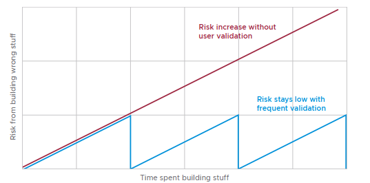

### Test your leap-of-faith assumptions

It's no longer good enough for a product manager to say, "I think users want this feature." Instead, you need to ask, "What outcome do we predict this feature will have?" and validate your answer with empirical data.

**Hypothesis-driven management**

Hypothesis-driven product management is the practice of treating the development of new products as a series of experiments. Instead of formulating requirements, we formulate hypotheses along with some validation criteria that state how strong of a signal we need to consider the hypothesis to be true. We use what we learn from each experiment to iterate on our ideas until we get where we want to go, or until we determine that the product isn't viable and cancel the effort.

**Leap of faith assumptions**

These are the riskiest assumptions we make about our idea; if we get them wrong, our product will fail. Our riskiest assumptions should align with the business outcomes or product goals we're working toward. By identifying our riskiest assumptions early and testing them through experiments, we dramatically reduce the uncertainty associated with our product ideas. Instead of trying to get it right from the start, we try to get it right one small piece at a time. We test our risky assumptions systematically in order of potential impact:

- **Problem/solution fit:** Have we found a problem worth solving? Can we solve it?
- **Product/market fit:** Have we built something the market wants?
- **Scale:** Have we found a sustainable business model?

**Experiments test our assumptions**

A lean experiment is the smallest experiment we can run to quickly test our assumption. We start small and fast and then increase the scale and scope of our experiments over time. An experiment consists of three parts: a hypothesis, a test, and validation criteria.

The **hypothesis** is a falsifiable version of our assumption. Remember to make sure you're only testing one variable in each hypothesis; otherwise, you won't get reliable data.

The **test** is how we intend to validate our hypothesis, proving it to be true or false.

The **validation criteria** are the evidence we need to consider the hypothesis true.

**Experiment template**

**Hypothesis**

We believe that <this capability\> will result in <this outcome\>.

**Test**

We'll do/make <this test\>.

**Validation criteria**

We'll know that our hypothesis is valid if we observe/measure <this outcome\>.

**Validation criteria**

You need to determine how much evidence is enough for you to consider an assumption validated. Here are some general rules to consider:

- During discovery, talk to as many people as possible.
- During usability testing, five people will help you identify 80 percent of the issues.
- If your organization is new to hypothesis-driven product development, define your validation criteria based on what you need to feel confident to justify the product decision.

#### Example: A lean experiment for HomeWiFi

HomeWiFi has identified an initial set of leap-of-faith assumptions. It decides to test the following assumption first because it believes this assumption poses the greatest risk to the success of the installer dashboard if proven invalid.

**Leap-of-faith assumption: Customers feel comfortable sharing ownership of their networks with their installers**

Installers currently use a customer-facing app to install new Wi-Fi networks. The installers will typically make themselves the owner of a customer's network and maintain that ownership post-installation, which ensures them continued access so that they can monitor and troubleshoot the network on an ongoing basis.

Because the installer accesses private network data without receiving explicit permission from the customer, however, a big privacy issue is
created.

To give installers what they need to provide the best possible service - reliable access to the customer's network - while also giving the customer what they need to feel safe regarding who has access to their data-the ability to grant and revoke network access - HomeWiFi must validate its assumption that customers are willing to share network ownership with their installer.

**HomeWiFi plans to test this assumption twice before building the new installer dashboard app. It will first test it without building any software at all (Lean experiment 1). Assuming the first experiment passes its validation criteria, HomeWiFi will run a second experiment in which it builds a new feature in the consumer app (Lean experiment 2). These experiments will enable HomeWiFi to test a core assumption relatively quickly and cheaply.**

**Lean experiment 1**

**Hypothesis**

We believe that giving homeowners the ability to share network access will increase network ownership transfers from the homeowner to the installer.

**Test**

We'll continue to use the consumer app to install new customers' networks, and while doing so, ask the customer if they agree to transfer network ownership to the installer (without building any new features for this in the app).

**Validation criteria**

We'll know that our hypothesis is valid if 90 percent of customers agree to transfer network ownership to the installer during the network installation.

**Lean experiment 2**

**Hypothesis**

We believe that giving homeowners the ability to share and revoke network access will increase network ownership transfers from the homeowner to the installer.

**Test**

We'll enable customers to receive and approve/reject ownership transfer requests from their installer via the customer app.

**Validation criteria**

We'll know that our hypothesis is valid if 90 percent of customers transfer their network ownership to their installer during network installation and 75 percent of customers maintain shared network ownership with their installer one-month post-installation.

### Experiment techniques

There are many types of experiments we can conduct to test our hypotheses. Which experiment type is right depends on what we're looking to learn.

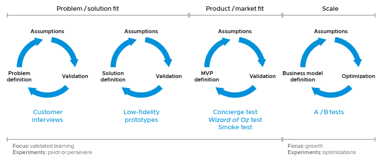

**Customer interviews**

These interviews help us validate the following assumptions:

- What are our customers' problems are
- How do they want to solve those problems
- What's standing in their way
- Who are our customer segments are
- Who within those segments are early adopters

**Low-fidelity prototypes**

Rough, early, testable representations of solution concepts that help us validate those concepts early on in the design process; can be as low fidelity as sketches on paper

**High-fidelity prototypes**

Detailed, early, testable representations of solution concepts that are clickable/tappable, which helps us validate those concepts both midway and late in the design process

**Walking skeleton test**

Implements a tiny part of the system to perform an end-to-end function, which helps us validate technical feasibility

**Concierge test**

Replaces a complex automated technical solution with humans who directly interact with the customer, which helps us validate whether anyone wants the solution provided by our product

***Wizard of Oz* test**

Replaces the product back end with humans so that the customer believes they're interacting with an automated solution, which helps us validate whether anyone wants our product

**Smoke test (or 404 test)**

Typically involves putting up a website that describes the product's value proposition and asks customers to sign up for the product before it's available to help us validate whether anyone wants our product enough to give something for it

**A/B test**

Presents two versions of a product or feature to see which one performs best. Works best with large sets of users for small incremental optimizations of an experience and business model

### Define your minimum viable product

The minimum viable product (MVP) is an experiment designed to test our product's value proposition.

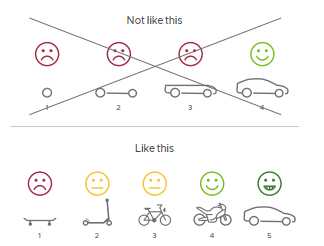{: class="float-right width-40"}

**MVP**

MVP is the most misunderstood concept in lean product development. Its purpose is to help us learn whether we should continue to build the product or not. Therefore, an MVP is not a delivery milestone; it's a learning milestone.

**The MVP is a learning milestone**

The MVP is the smallest possible version of our product that enables us to learn the most about our customers with the least amount of effort. Do early adopters of our product find it so valuable that they'd be upset if they were no longer able to use it? Have we found a repeatable way of selling our product? The MVP helps us answer these questions faster and with less waste.

Conversely, here's what an MVP isn't:

- The first version of a product that we feel comfortable showing our executive sponsors
- Available to the market
- A release that we define a priori
- A proof of concept
- A minimum set of features without an accompanying set of business goals and KPI
- A complete product for internal demonstration purposes
- Always Software

**The MVP is often not more than a few features that together help the user do something valuable. We learn and iterate on the product not by building one component of the value proposition at a time, but by delivering thin slices of the full value proposition. From that starting point, we then build out the product experience with increasing increments of value.**

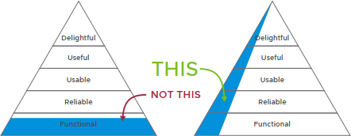

#### Examples: Minimum viable products

**Dropbox**

**Explainer video**

[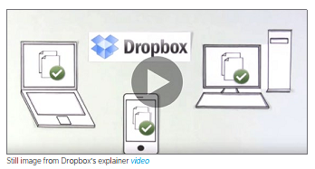{: class="float-right"}](https://www.youtube.com/watch?v=w4eTR7tci6A)

Dropbox is an extremely popular service for hosting and sharing files that are used by 500 million people and 200,000 businesses. Dropbox's early leap-of-faith assumption was that file synchronization was a problem most people didn't know that they had, but if Dropbox could provide a superior customer experience, people would try it. The team faced two challenges in testing this assumption:

- At the time, Dropbox as a concept was difficult for customers to understand because there was nothing else quite like it available.
- Dropbox is a highly sophisticated technical product, which made it impossible to demonstrate as working software without actually building it.
Instead of investing years in building the actual product, the team decided to make an explainer video to show how Dropbox works. The video attracted hundreds of thousands of visitors to the Dropbox site and grew its waiting list from 5,000 to 75,000 people.

**Zappos**

***Wizard of Oz***

Zappos is an online retailer with $2 billion in annual revenue. It was acquired by Amazon in 2009.

When Zappos was founded in 1999, people weren't yet accustomed to buying shoes and clothes online. Founder Nick Swinmurn's leap-of-faith assumption was that selling shoes online was a viable business idea. Instead of buying inventory and creating an online store, he headed to his local mall, photographed pairs of shoes, and posted them for sale on a simple website.

Whenever a customer placed an order, Nick would go back to the mall, purchase the shoes, and ship them to the customer. This enabled the Zappos team to quickly learn that people were willing to buy shoes online. They also learned about customer demand and which styles sold best.

**Airbnb**

**Concierge test**

Airbnb is a global accommodation rental service with annual revenue of $900 million.

In 2007, Airbnb's founders wanted to start a business. As they could barely afford their rent, they decided to offer their apartment (they were also roommates) as cheap accommodation for design conference participants coming to San Francisco. They photographed their loft, posted the photos online, and shared the link with some friends they knew were planning to attend the conference; those friends, in turn, shared the link even more widely. Soon, they had three paying guests. This enabled them to test (and validate) that people were willing to stay in a stranger's home rather than a hotel.

### Prioritize features

One of your most important responsibilities as a product manager is to prioritize features. That means deciding what to build (or not), and when.

Feature ideas can come from a variety of places:

- Anyone on the product team
- Your product sponsors and stakeholders
- Your founders and your board of advisors
- Your customers
- Your competitors

As product managers, we must filter these ideas. It's not possible to do everything, and it's even less possible to do everything at the same time. We need to make sure the team is only working on features that should be built, and always in a prioritized order: from highest value to next-highest value and so forth. That means we must learn when (and how) to say "no" in addition to when to say "yes." Unless you know when to say "no," you'll end up with a lot of tangentially related features, a complex product that no one is really happy with, and an overworked product team.

**Is it valuable? Can we do it?**

There are several heuristics you can apply to make informed prioritization decisions. You'll need to consider viability (will it help our business?), desirability (do our users want it?), and feasibility (can we do it?).

Feature prioritization is part science and part art. You'll need to develop an instinct for what your users want, and then use data and a robust process to back it up.

At a minimum, the features you decide to build should do the following:

- Satisfy needs or desires that are shared by most users.
- Help you make progress against a business goal.
- Be possible for the team to build well and ship fast.

> "People think focus means saying yes to the thing you've got to focus on. But that's not what it means at all. It means saying no to the hundred other good ideas that there are. You have to pick carefully. I'm actually as proud of the things we haven't done as the things I have done. Innovation is saying no to 1,000 things."
>
> STEVE JOBS

#### Example: HomeWiFi feature prioritization

1\. **Brainstorm feature ideas**

{: class="width-50"}

2\. **Organize the ideas based on impact against top user needs**

HomeWiFi has learned that installers have two primary needs when it comes to diagnosing network issues:

- They need to get reliable access to the customer's network via shared ownership.
- They need to know if it's a device connectivity problem or a HomeWiFi network node connectivity problem.

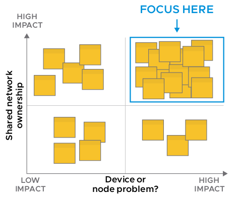

3\. **Take ideas that have a high impact relative to user needs and organize them based on impact relative to business goals**

To strengthen its position in the homeowner market, HomeWiFi needs to expand its footprint and popularity in the installer market. Therefore, its two primary business goals are:

- Grow the number of installers that support HomeWiFi's system.
- Help installers acquire new customers.

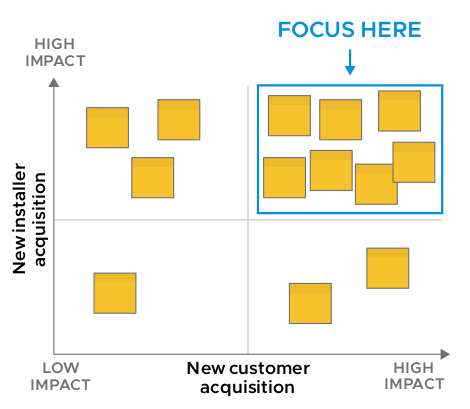

4\. Take ideas that have a high impact relative to business goals and organize them based on effort

Start by building features above the horizontal line.

These are features that help you address your top user needs and either one or both of your top business goals.

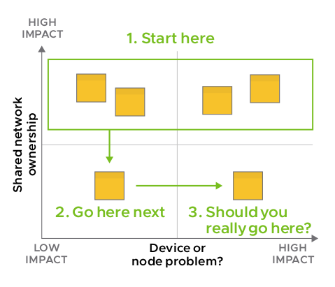

### Manage the backlog

The backlog is where we translate our product vision and strategy into the day-to-day, tactical work of software development.

**What is a product backlog?**

The backlog is a list of development work derived from the product roadmap, organized by priority. The most important piece of work is at the top. A well-organized and up-to-date backlog enables the team to build features and functionality efficiently, with a predictable rate of output.

As the product manager, you own the backlog. However, you'll gather input from all perspectives on the team to inform priority.

**Breaking down the product**

Many teams build products horizontally, breaking the work down along
architectural boundaries. For instance, separate teams might build the back-end and the front-end layers. The problem with this approach is that we can't ship anything usable to our users until we've finished and connected all the layers.

Agile teams aspire to work in vertical slices, which means they build the product one small feature at a time. This allows teams to deliver new value to users frequently and get their feedback on the new functionality. Frequent user feedback helps agile teams make necessary adjustments sooner and at a smaller scale than with big releases.

One vertical unit of development work may encompass GUI, client, and back-end work---whatever is needed to deliver one unit of value to the user. These thin vertical slices are commonly referred to as stories. As a product manager, you'll work closely with your team to split your development work into good stories.

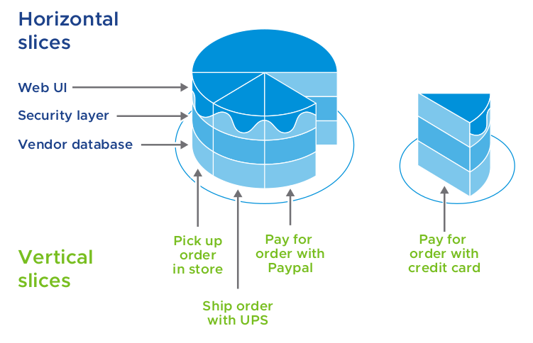{: class="width-80"}

**The smaller the slices, the better**

The smaller we can make a story, the simpler it will be to understand, estimate, implement, and test. We can more easily predict when features will be ready to ship. Developers can rotate through the codebase quicker and grow the team's bus count. Small stories enable frequent, tangible progress, which makes the team, the stakeholders, and the product sponsors feel good and means that value is delivered quickly to both users and the business.

**Continuous prioritization enables agility**

Agile/XP teams practice continuous prioritization. That is, although we do look a few weeks ahead to plan our work at a high level, we don't commit to a fixed sprint scope. That's because we might at any time learn about unexpected changes or new information that causes us to reevaluate our priorities. Continuous prioritization enables us to maximize our responsiveness to changing conditions and navigate complexity and uncertainty better than if we were to stick to a detailed, upfront plan.

Developers will always pick up and work on the story at the very top of the backlog, so the order of the stories is very important. A story's position in the backlog communicates its priority - the most important stories are at the top of the backlog, whereas less important stories are near the bottom. It's your job as a product manager to ensure the order of the backlog represents the latest priority.

### Balance value, quality, and constraints

Lean/agile teams must frequently make tradeoffs between value, quality, and constraints to successfully respond to change.

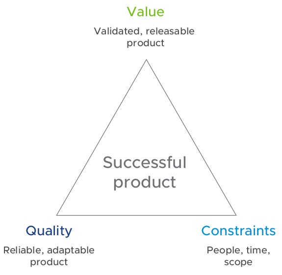{: class="float-right width-40"}

**Making tradeoffs against the right goals**

Project management and product management are two commonly applied mindsets when it comes to defining software success.

The role of the project manager is a tactical one in that they're responsible for achieving a specific, predefined objective by following a plan with fixed start and end dates and a fixed budget. Success in project management means delivering on time, in scope, and on budget.

However, in the context of product development, project management aims to solve the wrong problems. Product failure is rarely due to schedule slippage or cost overrun. It's more commonly caused by building something customers don't want, doesn't need, or that doesn't create sufficient business value.

This is why the role of the product manager is critical to product success. Product managers are responsible for defining what the product is and for whom, and how the product will drive business impact.

Success in product management means delivering the right value at the
right time.

**Value, quality, and constraints**

Product initiatives have three goals:

1. Create customer **value** that drives business impact.
2. Build and maintain **quality** to enable the team to develop, at speed, for as long as the business requires.
3. Deliver within given **constraints** around people, time, and scope.

Companies often want to keep all three of the goals fixed. However, because change is inevitable, this leads to failure - something unpredictable happens, and the team can't realize all three goals and burns out trying. It's why lean/agile organizations maintain flexibility by keeping fixed two goals at most and making tradeoffs when needed.

**What is value and why does it matter?**

Value is the benefit delivered to customers through the features we build and the business impact created when customers engage with the product. Value is measured by what our customers want or desire, and by the KPI we must meet to have a successful business.

To deliver value, we need to do the simplest thing that delights the customer while also enhancing our margin and helping to differentiate us in the market. This requires us to know what features to build or not build and to ship new and improved features continuously.

**What is quality and why does it matter?**

Quality is defined as reliability and adaptability. Reliability means that our customers have a consistently good experience using the product. Adaptability means that we're able to keep evolving the product at a predictable pace so that it continues to deliver future value. To maintain high quality and a steady foundation, we need to keep both our design and tech debt low.

**How should we think about constraints?**

Constraints are important, but they aren't the actual goals of the product. They work as guardrails for the team, establishing clear expectations around delivery. Only one of the three constraints - people, time, and scope - can be fixed. In agile organizations, it's usually time.

### Managing backlogs with Pivotal Tracker

At Cambria Labs, we typically manage the product backlog using an agile project management tool, such as Linear.app, Asana, or Pivotal Tracker.

**Why Tracker?**

Tracker is a simple, story-based, agile project planning tool that enables teams to collaborate and react instantly to real-world changes. It's based on agile software development methods, but it can be used on a variety of projects.

Tracker frees you up to focus on getting things done, without getting bogged down trying to keep your plans in sync with reality. Because of its simplicity, Tracker helps illustrate the basics of how stories are used as the key unit for planning and executing an agile development team's work, and many of these same principles can be adapted in other tools.

**How?**

Tracker acts as the central repository of project activity and also serves as a historical record of development progress. The tracker does this with a simple set of organizational constructs, as enumerated in the image to the right:

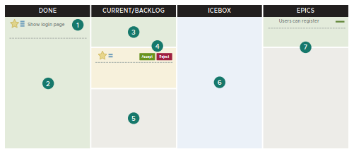

1. User story
:   A story in Tracker is a description of the deliverable unit of value to the user or delivery team. A feature user story is something that a user wants to do, like "See activity feed" or "Filter product catalog." Stories can be grouped by labels. The tracker also defines chores and bugs as different story types.

2. Done
:   Stories in this section have been implemented by the development team and accepted by the product manager.

3. Current
:   These are stories in the backlog that have been picked up by the developers on the team and are in various states of implementation. The developers update the story status as they start, finish, and deliver the functionality described in the story. Tracker calculates the points of all current stories to come up with the team velocity metric.

4. Accept and Reject
:   Stories that have been delivered await acceptance by the product manager. Functionality that matches the acceptance criteria outlined in the story should be accepted. Functionality that does not meet the acceptance criteria should be rejected, along with a comment explaining what is incorrect or missing. This enables the developers to get immediate feedback on a story-by-story basis as they deliver functionality.

5. Backlog
:   Stories in the backlog are ready to be estimated (assigned point values) or worked on, with clear descriptions and acceptance criteria. The story at the top of the list is the next story that will be implemented. Stories are prioritized based on what will add the most user value.

6. Icebox
:   Stories in the icebox need more thought and detail before they can go into the backlog. The content of the icebox does not need to be prioritized.

7. Epics
:   These are larger user stories or themes that are too big to be described in a single user story, like "User can register" or "Administrator should see user analytics."

#### Story workflow

Agile development consists of a continuous feedback loop. Each story has a workflow, from conception to release.

**Why?**

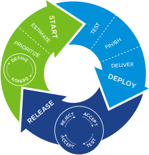{: class="float-right width-30"}

Agility is the result of frequent feedback. The ability to accept, reject and release stories enable you to give and get feedback from your customers, your team, and your stakeholders with every increment of functionality as you flow through these steps:

1. **Prioritize**. After writing stories, the product manager prioritizes them in the backlog.
2. **Estimate**. The team discusses and collectively estimates the level of complexity of each story. If the story cannot be estimated, that may be the first indication that the work it describes needs to be broken down into smaller stories.
3. **Start**. Developers pick up and begin work on the story when it's the next one at the top of the backlog.
4. **Finish**. The developers commit all code changes to the project repository and finish the story.
5. **Deliver**. The committed code changes go through continuous integration testing. Once it passes, the code for the new feature is deployed to the team's acceptance environment, and the story is delivered.
6. **Accept**. The product manager reviews delivered stories in the acceptance environment, checking against their acceptance criteria. If the acceptance criteria are completely met, they accept it; if incomplete, they reject it.
7. **Release**. The code for the accepted stories is pushed to the team's production environment, as often as appropriate, where users can interact with the new features.
8. **...and Repeat**. Based on user feedback, input from the business, and what we learned from our previous product release, the product manager determines what to prioritize next.

#### Plan with stories

Knowing what to do next is one of the agile product manager's most important skills. An effective product plan is made up of many small, independent user stories. This allows you to plan and easily respond to change.

**The product manager as a planner**

The product manager is accountable for planning the work efficiently. This means:

- Taking a large scope of work and breaking it down into manageable steps to complete it.
- Allowing the team to focus on completing the next priority on the list.
- Seeing the big picture and the progress needed to realize it.

Knowing how to prioritize, estimate, and organize stories and track team velocity is fundamental to good project planning.

**All stories must be prioritized**

Guided by input from users, stakeholders, and the development team, the product manager weighs user value, business value, development risk, and dependencies against each other to determine the priority of a story.

A story's position in the backlog makes clear its priority; the most important story is at the very top while the least important story is at the bottom. This makes it obvious which task the team will work on next.

Stories' priorities can change as business priorities change.

**User stories must be estimated**

All user stories need to be given a point estimate before developers can work on them. New stories are discussed in the weekly IPM. Once everyone understands the purpose of the story and agrees on the simplest way to accomplish it, the team can agree on its size.

Knowing the relative complexity of stories helps the product manager prioritize and set expectations with stakeholders.

For instance, you can decide to prioritize one big story or three small stories---the amount of work would be about the same, but in the first case, you'd ship one larger feature, whereas in the second case, you'd ship three smaller features. The team must focus on complexity rather than effort as the points are ultimately a planning tool, not an exact time estimate.

Neither bugs nor chores are given point estimates. The idea is that these two story types emerge over time, and while they do take time to address, they're an ongoing and fairly consistent cost.

**Stories can be grouped into epics**

A group of stories that represent a larger feature is called an epic. Epics help convey the overall, big-picture priorities.

**Velocity is a measure of average delivered story points**

Average velocity is an indicator of how many points a team can be expected to deliver in a given iteration. It's calculated by averaging the points delivered in previous iterations. Only completed stories count towards velocity, which is why regular story acceptance is important.

When your team gets good at building up features with small, consistently sized stories, it gets better at delivering roughly the same amount of work with each iteration. With lower volatility, your team's velocity becomes a more useful planning tool. Tracker automatically projects out the pointed stories in your backlog that will likely fall into future iterations, reflecting past reality and serving as informed predictors.

**Respond to change**

When building software, it's impossible to gather all the requirements upfront. Responding to change requires knowing how to reprioritize, reestimate and reorganize stories.

#### Write user stories

A user story is a short, simple description of a feature told from the perspective of the person who desires the new capability, usually a user or customer of the system.

**Why do we care about user stories?**

User stories are designed to explain the who, what and why of the smallest incremental feature that can be added to a product. They are written from the user's perspective, explain the incremental business or user value, and act as lightweight requirements documentation for a development team. A story is a placeholder for a conversation. After a story is completed, it becomes a view into our conversation history and the decisions we've made.

**Who writes stories?**

Although anyone on the team can contribute stories, it's the product manager's responsibility to maintain a healthy backlog. They do this by writing and prioritizing enough user stories for two weeks of development work.

**How?**

Although user stories serve as placeholders for conversations with agile development teams, they should nevertheless be written in a detailed and consistent manner to help provide the team with the context they need to inform that conversation. These are the key components of a user story:

|                                                   |                                                   |
|:--------------------------------------------------|:--------------------------------------------------|
|  1\. Title   Should be short and descriptive enough to understand, at a glance, the functionality to be enabled with delivery of this story. |  2\. Description   Should explain WHO wants the functionality, WHY they want it, and to WHAT end. The clearer this context is for the team, the better equipped they are to make decisions and evaluate tradeoffs during implementation of this functionality.    The commonly used Connextra format can be used as a starting point to provide this information.   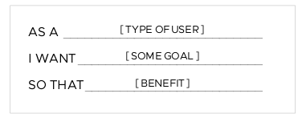 |
|  3\. Acceptance criteria   Should list the scenarios the product manager will use to verify that the story has been completed and enables the desired functionality. This is also used as a starting point for the developer’s tests, and helps delineate when work on this story is "done."    The commonly used Gherkin syntax can be used to make acceptance criteria and test scenarios clear for everyone on the team.    |  4\. Resources   Should include all mocks, wireframes, user flows, and other assets that help explain the user story.   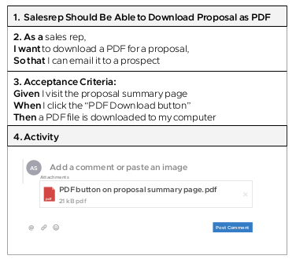 |

##### Example user stories: good vs. bad

A backlog of well-written user stories enables the team to focus on doing the work rather than trying to define the work.

|                                                   |                                                   |
|:--------------------------------------------------|:--------------------------------------------------|
| Example: Good user story   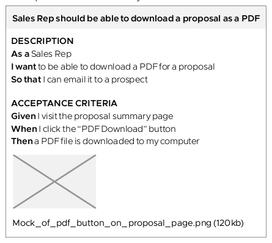 | What makes this a good user story?   - The title is clear and descriptive   - The user is clearly identified   - There’s a clear beginning and end   - The acceptance criteria satisfy the user’s goals   - There are resources attached that describe all the nonobvious details that are important to the user and the business   - It represents the smallest amount of verifiable functionality that provides incremental value. |

|                                                   |                                                   |
|:--------------------------------------------------|:--------------------------------------------------|
| Example: Bad user story   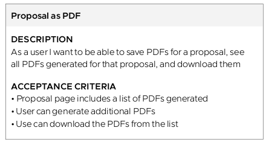 | What makes this a bad user story?   - The title is vague   - The type of user is not clearly identified   - There’s no clear beginning or end   - The user’s goal isn’t identified; we don’t know why they want this feature   - The acceptance criteria are written like a set of stories, which indicates the story is too big   - There are no resources attached to explain the nonobvious details |

#### Other story types in Tracker

Chores, bugs and release markers enable you to capture work that needs to get done but doesn't provide direct value to the user or the business.

**Chores, bugs and release markers are stories, too**

Just like the user story, these story types represent concrete tasks or deliverables. However, because they don't provide direct business or user value, they don't get estimated. (Learn more on this in "[*Run The Iteration Planning Meeting*](#run-the-iteration-planning-meeting).")

|                                                   |                                                   |
|:--------------------------------------------------|:--------------------------------------------------|
|                 | **Release marker**    Releases are milestone markers that allow your team to track progress towards concrete goals, such as stakeholder or investor demos, software launches, and more. Using these markers, it's possible to specify target dates for releases. The product manager decides how to organize the backlog into releases. |
|                         | **Chore**   A chore is a story that provides no direct, obvious value to the user, but is needed for product development. Here are some example chores:   - Set up new domain and wildcard SSL certificate for test environments   - Evaluate tools for system troubleshooting   - Conduct exploratory testing (this is often referred to as a "charter")   Chores can represent "technical debt" and/or points of dependency on other teams. Chores are not estimated, as they don’t directly contribute business value. Developers, often in partnership with the product manager, create chores for the backlog. |
|                           | **Bug**   A bug is a defect in a feature that’s already been accepted, regardless of when it was accepted. You shouldn’t use bugs to detail new features and functionality. Here are some examples of bugs:   - Price should be non-negative   - Login button doesn’t work   Bugs don’t have points because they’re directly related to features that have already been delivered. A bug description should include steps to recreate the bug such that anyone, with minimum context, can see the bug themselves.   Anyone on the team can create a bug. It’s up to the product manager to prioritize it. |

**Know your story makers**

|                                     |                                                                          |
|:------------------------------------|:-------------------------------------------------------------------------|
| {: class="width-30"} | **User story**: The "who," "what" and "why" of a new feature |
| {: class="width-30"} | **Story points**: The estimated relative complexity of a story |
| {: class="width-30"} | **Chore**: Tasks that are necessary but don't add direct or obvious user value  |
| {: class="width-30"} | **Bug**: Tasks that will resolve unintended behavior            |
| {: class="width-30"} | **Release**: A project milestone                            |

### Run the iteration planning meeting

The iteration planning meeting (IPM) is core to our agile development practice and provides the opportunity for product managers to communicate the vision for the upcoming iteration.

**Frame the conversation**

Establish the theme of the next iteration, and tie it back to product and project goals. For example, "Just to reiterate, last week we focused on making our site more mobile friendly, and this week we're going to revisit the sign-up flow with some improvements. This will help us convert more people coming in from our new mobile marketing campaign."

**Clarify the stories**

Start by looking at any stories still in progress from the last iteration, along with any pertinent information about features just finished. This should be a quick process (i.e., fewer than 10 minutes) to jog everyone's memories and ground them in the work that's coming up.

Starting at the top of the backlog, step through each story. Talk through the user-facing value of a feature, and ensure that any comps, wires, assets, flows, and data are attached to the story. Clarify any acceptance criteria and add any clarifying notes that may be needed.
The goal here is to be crystal clear on when a feature is "done-done."

**Run a complexity check and estimate**

Each developer that could work on a story should provide an estimate of the story's complexity in several points. If the implementation is not clear, they should have time to talk through approaches during the IPM. That said, their role is to nail down a level of complexity, not pin themselves to a specific technical implementation in this setting. Based on the estimated size or developer feedback, stories can be nominated for merging or splitting up. If that's the case, capture the pieces of work as placeholders and update them with details after the IPM.

**Pay down debt**

A healthy development process will incorporate refactors and tackle technical debt in concert with new user value. In addition to explicit tech debt chores, product managers and developers should look for opportunities to wrap this work into feature development. For example, if a story calls for adding a field to an existing form, you should consider also cleaning up the logic that delivers form validation errors.

**Estimate stories out to two iterations, max**

The tracker will group stories into iterations based on the team's historical velocity. You should only step through stories until you've got two iterations' worth of estimated work. Keep the visibility to two weeks so you're able to cover for any quicker-than-intended delivery of features, and limit the IPM to a reasonable amount of upcoming work. It's taxing to keep the mental inventory of features in your head; sticking with the short-term future focuses everyone on the team around tangible new features.

**Keep it short and sweet**

Once you reach the one-hour mark in an IPM, as with many meetings, people zone out and business owners get antsy about the emails they're missing (or worse, they whip out their phones). When you have a large team, it's especially important to play time cop. If you don't have a healthy backlog and find yourself with a lack of new work, end the meeting. It's far better to hold an additional IPM two days later than to suffer the pain of making up stories in real time!

### Decide when to ship software

The more often we ship, the more often we deliver concrete value to our customers and validate our product strategy.

**Ship early and often**

The ultimate goal of any product team is to ship the right working features to users. It's not until our customers interact with our features that we truly know whether we built the right features and designed and implemented them well.

User testing that doesn't put software into the hands of real users limits what we can learn. Working software can help answer questions like, "Have we built enough? Are we focusing on the most important feature first? Are we likely to hit the key performance indicators that the business believes we're going to hit?"

We want to keep this feedback loop with our users as short as possible so that we can continuously validate our product direction. Should we go deeper on features we have, or go wider on new features? We want to release the smallest thing possible that - in light of user value, business objectives, and technical constraints - will provide data showing what our users find valuable, which will then inform our work.

We also want to make our releases as easy and cheap as possible. If releases are risky, expensive, and cumbersome, we'll push them off, and only be able to release occasionally. A repeatable, regular, successful, reliable, and cost-effective release process is critical to our ability to continuously deliver small chunks of value.
Frequently releasing thin slices of our product enables us to easily roll back any changes, and to debug issues quickly.

**Can we ship?**

Because our ability to ship depends on our delivery infrastructure and the quality of our code, whether or not we can ship is a technical decision. Our ideal state is to always be able to ship so that we can release new features whenever it makes sense to do so from a business perspective.

Our ability to ship is impacted by several factors:

- Code quality
- Test coverage
- Our knowledge of what's needed to deploy code to production
- Story size and quality

**Should we ship?**

The decision to release should come from the business. We need to weigh the user value we can deliver right now against the cost and risk of shipping. We do this by gathering input around the following:

- **User needs:** How urgently do users need a new feature or refined feature design?
- **Stakeholders:** Are marketing, sales, customer service, and other teams ready to support the features we want to ship?
- **Other product teams:** If we depend on other teams' services being in production before we can release them, we need to make sure those services are ready for us to use.
- **Release size:** The bigger the release, the riskier it is.
- **How manual our process is:** The more manual the process, the more expensive it is.
- **Delivery infrastructure:** How easy is it to push code to production?

**What's the path to production?**

Be proactive about understanding and satisfying the requirements for reaching the production environment in your organization. This may take longer than expected and become a blocker for the team.

### Help establish a sustainable pace

To deliver value fast forever, we need to make sure we're running at a comfortable marathon pace rather than rushing through a series of high-intensity sprints.

**Let's go fast, forever**

Keeping a sustainable pace is a core tenet of XP. It states that the team should aim to establish a work pace that they can sustain indefinitely. This enables teams to build better software, ship it predictably, and do so with regularity.

Cambria Labs communicates its belief in sustainable pace by encouraging teams to establish core hours (typically starting at 9 AM and ending at 6 PM sharp for co-located teams) with a full one-hour lunch break. Team stand-ups and other ceremonies should only be scheduled within core hours, and regular breaks throughout the day are encouraged to help everyone refresh between bursts of highly focused activities.

**More hours, more problems**

We believe that building a product is a marathon, not a sprint. We don't do "crunch time" at Cambria Labs. We believe that putting in significant overtime is detrimental to work quality, team productivity, and team health.

Willpower is a depleting resource. If we don't replenish it with sleep and sufficient downtime, our discipline and work suffer. Long hours lead to burnout and poor decision-making. A developer who stays up late to code a feature will realize the next morning that they'll need to rewrite it all. Even if the code is good, working late without the rest of the team reduces shared ownership of the project by creating knowledge silos. Working just 8 hours a day at full intensity will produce better results than working extra hours regularly.

We believe that Cambria Labs teams get more done by identifying and minimizing any nonproductive activities during the workday, as it allows them to focus on value-generating activities instead. Hours spent don't matter if we focus on maximizing the value we produce.
Many clients report being exhausted after their first week on a product team with Cambria Labs--that's what happens when you get an uninterrupted 8 hours a day to work!

Product managers play a critical role in maintaining a sustainable pace by prioritizing the right product and business goals and communicating with the right stakeholders to ensure that whatever is delivered isn't a surprise. This means conducting regular stakeholder check-ins and demos as needed, maintaining an up-to-date product roadmap, and creating consensus with the business to avoid scope creep and "crunch time." Product managers should also lead efficiency-improving activities such as removing team blockers, eliminating unproductive meetings, and boosting team morale. Think outside the box for how you can contribute to a sustainable pace and team happiness - no team ever complains when their product manager surprises them with donuts!

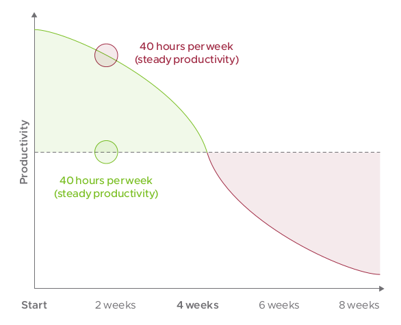

### Communicate effectively

To launch successful products, you need to build a shared understanding with your team, your stakeholders, and your sponsors of the what, when, who, why, and how of the product and each iteration of it.

**Strong communication skills help you lead without authority**

You'll be championing your product to sponsors within your organization, making tradeoffs with stakeholders and other product teams, and facilitating the making of daily, tactical decisions within your team. You'll need to inspire trust as well as motivate and influence all parties to help you and your team bring a successful product to market. The strength of your communication skills will determine how well you'll be able to develop the credibility and strong relationships needed to do so.

**Stakeholders:** Functional teams such as legal, security, sales, and marketing will want to know that you understand their needs and how your product supports their goals. For instance, marketing will want to know how your product will drive leads, and sales will want to know how your product will help close those leads.

**Sponsors:** Executive sponsors will want to know how your product will increase the bottom line. Share with them the strategic objectives and KPIs you're working toward, and once launched, document and share with them the business impact the product is having.

**Core team:** Create pathways for short feedback loops amongst core team members. Make sure you're responsive to your team's communication needs by being present and available. Share incoming information from sponsors and stakeholders quickly and as appropriate - shield the team from information overload while making sure they have the information they need to do their work.

**Others:** Your team may be taking a very different approach to working than other teams in your organization. Help your colleagues understand how being lean/agile/user-centered impacts the cadence, needs, health, and success of your product and your product team.

**Tips for effective communication**

There are several ways to communicate effectively that are especially important as a product manager.

**Tell a story**. Why does the product exist? Why does it matter? A compelling product story will make the product feel real and create an emotional bond, which will inspire others to invest in its success. Use anecdotes, user journeys, prototypes, videos, and other artifacts to help tell your product's story.

**Explain the big picture**. Share the vision, strategy, and roadmap. Help everyone involved understand what outcomes you're working toward and how you'll know that you've succeeded.

**Be believable**. When you communicate product decisions, make sure you do so with logic, empirical evidence, enthusiasm, and a focus on driving business impact by satisfying customer needs and desires. Let product designers and anchors communicate the rationale behind their design and technical decisions, respectively.

**Adjust the message and content to your audience**. Tell them only what they need to know to make a decision or take an action.

**Be honest**. When new information arrives that necessitates a shakeup of the product plan, you must have the courage to recognize any issues, communicate new data and insights back to the team and the product's stakeholders, and facilitate the creation and implementation of a new plan.

**Be proactive**. To build trust with stakeholders and collaborators, share updates with them proactively. Don't wait until the last minute or when you need something to reach out.

**Listen well**. Be as interested in learning from others as you are in sharing with them. Active listening will help you build stronger relationships and may also help you gain new insights that improve your product.

## Glossary

|                                               |                                                   |
|:----------------------------------------------|:--------------------------------------------------|
| **Agile**                                     | A collection of software development methods based on iterative and incremental development in which requirements and solutions evolve through collaboration between self- organizing, cross-functional teams. It's a conceptual framework that promotes well-planned, small iterations throughout the development cycle. |
| **Anchor role**                               | An experienced developer who, in addition to coding full time, leads the technical aspects of the project from start to end. The anchor acts as a resource for the rest of the development team for technical and nontechnical issues. |
| **Backlog**                                   | A list of prioritized stories that show the planned work for the current iteration. Stories can be added and removed from the backlog during an iteration and reprioritized as needed. |
| **Balanced team**                             | An autonomous team composed of people with a variety of skills and perspectives who support each other toward a shared goal. The team values cross-disciplinary collaboration and iterative delivery. |
| **Blocker**                                   | A situation or issue raised during daily standup that's delaying or preventing project progress. The team self-organizes to resolve the blocker; when it cannot be unblocked by the team, it can be escalated to the client liaison and/or stakeholders.  |
| **Build, measure, learn**                     | A core component of lean startup methodology.Build-measure-learn is a feedback loop in which a team first figures out what problem needs to be solved, then builds and tests the smallest possible solution. |
| **CI**                                        | Continuous integration. A dedicated server that periodically runs a project-specific set of tests. |
| **CD**                                        | Continuous delivery. The ability to make changes safely and quickly into production and available for the user in a sustainable way. |
| **Design crit**                               | A session designers run to get feedback from fellow designers and product managers. |
| **Design review**                             | A weekly team meeting that yields the designer a clear list of updates to the designs and workflows they've presented based on feedback from developers, product managers, and client stakeholders around feasibility, business value, brand, priority, and scope.  |
| **Design studio**                             | A solution brainstorming activity a designer leads to gather ideas in the form of sketches.  |
| **Empathy**                                   | The ability to understand what other people are thinking and feeling, to take their perspective. We hire for empathy and compassion because it enables us to be kind and effective collaborators, and good collaborators build happier teams. |
| **Epic**                                      | A collection of stories that make up a larger product release, feature set, or development focus. Epics are useful for prioritizing groups of stories against other groups of stories. |
| **Iteration**                                 | A planning cycle, typically lasting one week. Planning and development is iterative; because we're constantly coding and testing, the products we build are always ready to go live, which allows us to make changes in response to evolving business requirements. Daily and weekly software builds provide constant validation that the software meets the business requirements, so we always have complete control of the product and the timeline. |
| **Iteration planning meeting (IPM)**          | A weekly meeting at the start of an iteration during which the team reviews the upcoming stories in the backlog, ensures the backlog is full for the next two or three iterations, confirms the prioritization of stories, and estimates any unestimated stories using a point system. |
| **Lean**                                      | The practice of building products that deliver the most value to customers and minimizing waste by systematically identifying assumptions and validating them with actual users. |
| **Minimum viable product (MVP)**              | The cheapest, fastest, simplest thing that can help validate or invalidate a hypothesis about customer behavior. |
| **Pair programming**                          | The practice of having two developers work together at the same computer to complete each task. At Cambria Labs, we pair all the time. This practice of focusing two minds on a single challenge leads to better decisions the first time around, fewer knowledge gaps, and continual implicit training and knowledge transfer. Pairing results in fewer defects, better code, and ultimately much more sustainably efficient development. As pairs rotate, knowledge spreads rapidly throughout the team, eliminating knowledge silos and enabling team growth. |
| **Persona**                                   | A prototypical model of a user based on research that collects the needs, goals, context, and tasks of multiple actual users. Personas help us gain and retain empathy for the users we serve. |
| **Pivot or persevere**                        | Related to a change in strategy, not vision. To pivot means to change your business model, product, or target market based on feedback from the market that your current plan isn't working. To persevere means to continue to follow your plan based on feedback that it's working. You should regularly revisit your strategy in a "pivot or persevere" meeting. |
| **Pointing**                                  | In order to measure a story's complexity, Cambria Labs uses a point system of 0, 1, 2, 3, 5, and 8 points. During an IPM, developers will discuss and agree on a point estimate that--to the best of their understanding-reflects the story's complexity and risk. Points do not reflect a measure of how much time a story will take to complete since time is especially difficult to estimate and can vary based on external factors. Measuring relative complexity or risk is easier and yields more consistent assessments of team progress. |
| **Rapid prototyping**                         | The quick and early development of a small-scale prototype used to test out certain key features of the product design. Useful for learning quickly and cheaply.|
| **Retro**                                     | A meeting that provides a team the opportunity to give positive and negative feedback to each other, in a structured way, to yield action items. Team members identify aspects of the previous week that went well and aspects that went poorly. We typically reflect on issues ranging from technical choices, to inter-role communication, to the working environment. We then group our reflections into themes, brainstorm around those themes, and assign action items to remedy any issues. To improve accountability, sometimes each retro begins with a review of the prior week's action items. |
| **Risk (product)**                            | The probability of wasting time and resources on features that don't provide business or user value. |
| **Service blueprint**                         | A diagram of a user's path through an experience, including physical, in-person,and onscreen touchpoints. The diagrams are key to communicating a complex flow, especially if there are multiple interactions spread over several days, weeks, or even months. |
| **Standup**                                   | A short, daily meeting--usually held first thing in the morning--to discuss what was accomplished the previous day, share any info that is valuable to the entire team, ask for help, and determine pairs for the day. The meeting is meant to be as short as possible; any discussions that only involve a subset of the team are moved into separate meetings. |
| **Stakeholder**                               | An individual who stands to gain or lose from the success or failure of a product, feature, or solution. They understand and represent business interests or functional teams. They may also possess valuable knowledge about customers and end users. |
| **Style guide**                               | A document that serves as a guide for visual design elements. More specifically, a living style guide is a living document of code, which details all the various elements and coded modules of the application.  |
| **Test-driven development (TDD)**             | A software development process that relies on the repetition of a very short development cycle. The developer writes an (initially failing) automated test case that defines a desired improvement or new function, produces the minimum amount of code to pass that test and refactors the new code to acceptable standards. |
| **User-centered design (UCD)**                | An approach to product design where the user is put at the front and center of every design activity, so as to de-risk the product early and often. The team involves representative end users throughout the process of discovering, defining, designing, developing, delivering and optimizing the product in order to determine whether the features and user experience are useful and usable. |
| **Velocity**                                  | A measure of how many points a team can be expected to deliver in a given iteration that is calculated by averaging the points delivered in previous iterations. |
| **Volatility**                                | A measure of how variable a team's velocity is. |
| **Extreme programming (XP)**                  | A flavor of agile software development. Elements of XP include programming in pairs, automated testing of all code, avoiding the programming of features until they are actually needed, ensuring simplicity and clarity in code, expecting changes in customers requirements as time passes and the problem is better understood, and frequent communication--both with the customer and among programmers. |

## Reading List

Check out these books, videos and articles to dive deeper into concepts and tools.

**Lean**

- [*Lean Analytics*](http://leananalyticsbook.com/)   by Ben Yoskovitz and Alistair Croll
- [*The Lean Enterprise*](https://www.amazon.com/Lean-Enterprise-Corporations-Innovate-Startups-ebook/dp/B00J0VZS16/ref%3Dsr_1_1?ie=UTF8&qid=1407236653&sr=8-1&keywords=the%2Blean%2Benterprise)   by Trevor Owens and Obie Fernandez
- [*The Lean Startup*](https://www.amazon.com/Lean-Startup-Entrepreneurs-Continuous-Innovation-ebook/dp/B004J4XGN6/ref%3Dsr_1_1?s=digital-text&ie=UTF8&qid=1503688949&sr=1-1&keywords=the%2Blean%2Bstartup%2Beric%2Bries)   by Eric Ries
- [*The Lean UX*](https://www.amazon.com/Lean-UX-Applying-Principles-Experience/dp/1449311652/ref%3Dsr_1_2?s=books&ie=UTF8&qid=1503688971&sr=1-2&keywords=lean%2Bux%2Bjeff%2Bgothelf)   by Jeff Gothelf and Josh Seiden
- [*Running Lean*](https://www.amazon.com/Running-Lean-Iterate-Works-OReilly/dp/1449305172/ref%3Dsr_1_1?s=books&ie=UTF8&qid=1503689020&sr=1-1&keywords=running%2Blean%2Bash%2Bmaurya)   by Ash Maurya
- [*The Startup Way*](https://www.amazon.com/Startup-Way-Companies-Entrepreneurial-Management/dp/1101903201/ref%3Dsr_1_1?s=books&ie=UTF8&qid=1503689039&sr=1-1&keywords=the%2Bstartup%2Bway%2Beric%2Bries)   by Eric Ries
- [*Making Sense of MVP*](https://blog.crisp.se/2016/01/25/henrikkniberg/making-sense-of-mvp)   by Henrik Kniberg

**User-Centered**

- [*The Design of Everyday Things*](https://www.amazon.com/Design-Everyday-Things-Donald-Norman/dp/1452654123)   by Don Norman
- [*Just Enough Research*](https://www.amazon.com/Just-Enough-Research-Erika-Hall/dp/1937557103/ref%3Dasap_bc?ie=UTF8)   by Erika Hal
- [*Practical Empathy*](https://www.amazon.com/Practical-Empathy-Collaboration-Creativity-Your/dp/1933820489)   by Indi Young
- [*Talking to Humans*](https://www.talkingtohumans.com/)   by Giff Constable
- [*Satisfy The Cat*](https://www.youtube.com/watch?v=dln9xDsmCoY)   by John Boykin

**Pivotal Tracker**

- [*Getting Started with Pivotal Tracker*](https://www.pivotaltracker.com/help/articles/quick_start/)   by Pivotal Labs

**Agile Development**

- [*Extreme Programming Explained*](https://www.amazon.com/Extreme-Programming-Explained-Embrace-Change/dp/0321278658/ref%3Dsr_1_1?s=books&ie=UTF8&qid=1488833020&sr=1-1&keywords=extreme%2Bprogramming%2Bexplained) (especially chapters 1-7)   by Kent Beck with Cynthia Andres
- [*Agile Product Ownership in a Nutshell*](https://www.youtube.com/watch?v=502ILHjX9EE)   by Henrik Kniberg
- [*INVEST (mnemonic)*](https://en.wikipedia.org/wiki/INVEST_(mnemonic))

**Other**

- [*Balanced Team*](https://tanzu.vmware.com/content/blog/balanced-team-janice-fraser)   by Janice Fraser
- [*What makes a great product manager*](https://springone.io/2020/sessions/what-makes-a-great-product-manager)   by Michael Gresham, Adrien Hensley, Kenneth McDougall, Jennifer Handler

## Credits & Contributions

- Pivotal Labs Product Manager Playbook, by Pivotal
