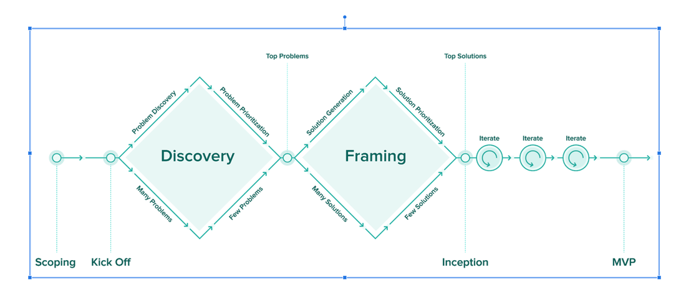

# Product Development Process

## User Research
- Identify users
- Interview Users in their environment
- Synthesize User Research Notes
- Identify Pain Points and Insights about the Problem Space
- Map out complex systems in User Journeys. Systems involved.
- Identify user difficulties and user delights.

## Scoping

## Kickoff

## Discovery & Framing
Collaborative process that takes place prior to software development. Flexible set of activities designed to ensure we are building the right thing.

### Problem Discovery
Goal: Narrow down the problems we want to solve.
Process:
- Discover Problems
- Filter Problems
- Prioritize Problems
- Identify Top Problems

## Solution Framing
- Solution Generation
- Filter Solutions
- Prioritize Solutions
- Identify Top Solutions

## Inception
The goal of the Inception Process is to rapidly prototype and validate the project's assumptions, so that the team can make informed decisions about how to proceed with development.
- Inception Planning Session
	- Define vision, goals, and objectives

## Minimum Viable Product (MVP)
A minimum-viable product (MVP) is a product with just enough features to be able to be released to a subset of potential customers and gather feedback on the product. The MVP is a concept that originated in the Lean Startup methodology, and is used as a way to quickly test and validate product ideas.

The team uses the MVP to gather feedback from users, and iterate on the design based on what they learn. By focusing on building an MVP first, and then iterating based on user feedback, the team is able to validate their assumptions about the product and ensure that they are building something that meets the needs of their customers.